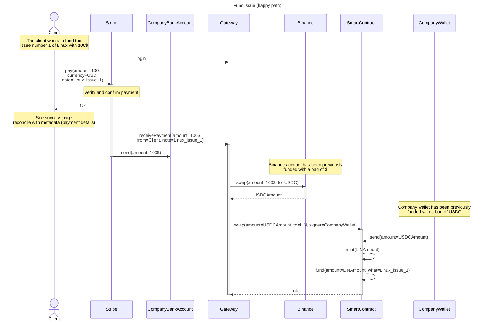

### DESCRIPTION
* `SmartContract` is a contract that aggregate two other smart contracts: the Augmented Bonding Curve for `OSE` and `LIN` token, as described in the white paper. This contract is used to mint new tokens and fund an issue.
More details on diagram [smart_contracts](smart_contracts.md).
* `Stripe` is a payment gateway. We will use it's `Checkout` feature. See how it works in details [here](https://docs.stripe.com/payments/checkout/how-checkout-works?payment-ui=embedded-form#lifecycle).

### FUTURE IMPROVEMENTS

> Be sure that the swap is processed even if the gateway crashes. 

> We should add other exchanges (like coinbase) to have a back-up if Binance is down.

### VIDEO
[Explanatory video](https://youtu.be/CCO8v1yHzKA) of this diagram.