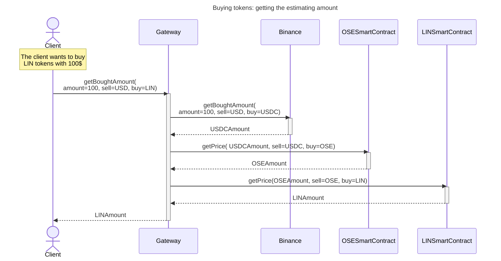

### DESCRIPTION

* `OSESmartContract` and `LINSmartContract` are an Augmented Bonding Curve smart contract as described in the white paper.
* `OSESmartContract` quote currency is USDC. 
* `LINSmartContract` quote currency is OSE.

### FUTURE IMPROVEMENTS

> Query the price on demand is not the best solution
> * First  the user does not see the price ticking. We should have a websocket to update the price in real-time.
> * Second, we should have a cache system to store the prices for a certain amount of time.

> We should add other exchanges to have a back-up if Binance is down.

### VIDEO
[Explanatory video](https://youtu.be/bVjSHMxHiRc) of this diagram.