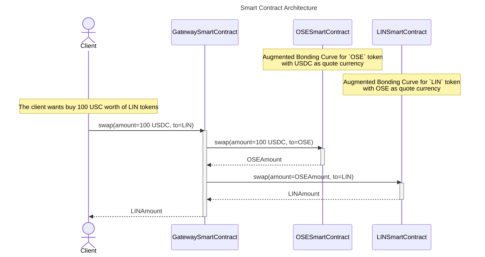

### DESCRIPTION
*  An `Augmented Bonding Curve` is a smart contract that is managing the liquidity and the price of a token. See [Open Source Economy White Paper](www.open-source-economy.com) for more details.